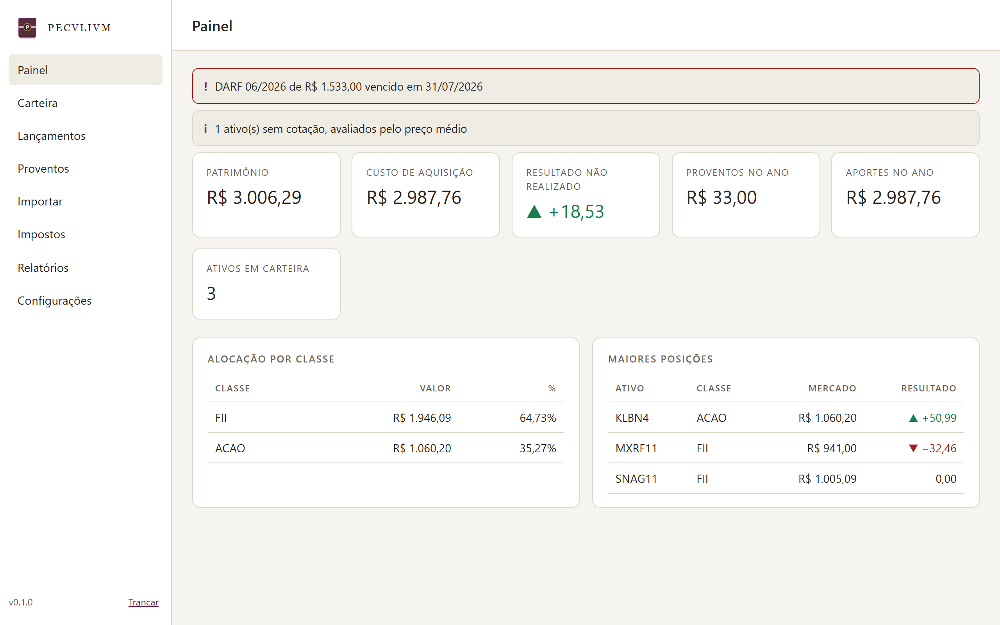
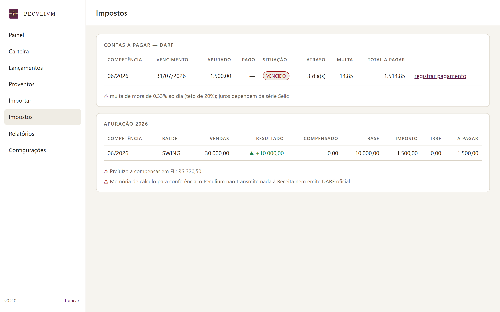

<p align="center"></p>

# Peculium — Gestão de Patrimônio Pessoal

       [](https://doi.org/10.5281/zenodo.21767164) [](https://github.com/devtulio/peculium/actions/workflows/ci.yml)

## Descrição

O **Peculium** guarda e apura a carteira de investimentos de uma pessoa: cada
compra, venda, provento e evento corporativo, com o preço médio, o resultado e o
imposto que decorrem deles. É um programa de **desktop**, monousuário, e o acervo
inteiro vive num **arquivo cifrado por senha mestra** — não há servidor, não há
porta de rede aberta e nada é enviado para lugar nenhum.

Ele lê os relatórios da B3 e as **notas de corretagem em PDF**, que são a única
fonte dos custos operacionais: o relatório da bolsa não informa corretagem nem
emolumentos, e sem eles o preço médio nasce errado — e o imposto atrás dele.

> *Peculium*, em direito romano, é o patrimônio que o *filius familias*
> administrava em separado do patrimônio do *pater*, com gestão e escrituração
> próprias (Digesto 15.1, *De peculio*). Patrimônio pessoal sob gestão de quem o
> opera. A divisa **SVVM · CVIQVE** — "a cada um o que é seu" — é o terceiro
> preceito do direito em Ulpiano.

## O que ele faz

- **Carteira** — posição, preço médio e resultado por ativo, com marcação a
  mercado opcional. Ativo sem cotação é avaliado pelo preço médio: o patrimônio
  fica conservador, nunca otimista.
- **Lançamento manual** — compra, venda, **portabilidade entre corretoras**,
  dividendos, JCP, rendimentos, amortização, bonificação, subscrição, taxas — e
  eventos corporativos (desdobramento, grupamento, conversão, incorporação), que
  reescrevem o preço médio para trás.
- **Importação da B3** — relatórios de Negociação e Movimentação (CSV e XLSX),
  idempotentes: reimportar períodos que se sobrepõem é o caso normal.
- **Conferência contra a B3** — o relatório de Posição é lido como retrato, e
  **nunca vira lançamento**: ele não traz o custo de aquisição, e inventá-lo
  corromperia o preço médio. Ele aponta o que falta lançar, grava os preços
  oficiais do dia sem precisar de rede — inclusive o do Tesouro IPCA+, que não
  tem outro jeito de ser precificado — e completa o cadastro de renda fixa.
- **Notas de corretagem** — leitura do PDF no layout Sinacor, com rateio dos
  custos e reconciliação com o que já veio da bolsa, sem duplicar negócio. Para
  **renda fixa** há um leitor por corretora (XP e Inter), porque cada uma inventa
  o próprio layout — e importar a nota cadastra o papel e lança a aplicação junto.
- **Renda fixa e Tesouro** — CDB, LCI, LCA e Tesouro Direto com **valor na curva**
  calculado das séries do Banco Central. IPCA+ pede preço à mão, porque depende do
  VNA oficial — e preço digitado sempre vence o calculado.
- **Imposto de renda** — apuração mensal em baldes que não se compensam entre si,
  isenção dos R$ 20 mil sobre o valor bruto, prejuízo acumulado, IRRF que
  atravessa o mês e DARF com piso que acumula em vez de sumir. Renda fixa fica de
  fora: é tributada na fonte, pela tabela regressiva.
- **Contas a pagar** — o que foi apurado contra o que foi pago, com multa de mora
  e alerta de vencimento.
- **Relatórios** — dez, em HTML timbrado e CSV, incluindo o fluxo de caixa mensal
  dos proventos e a posição pelo custo de aquisição em 31/12 para a declaração.

<p align="center">
  
  
</p>
<p align="center"><em>Painel (tema Atrium) e contas a pagar (tema Aerarium).
Há ainda o tema Cera, em papel e serifa.</em></p>

## Como funciona

O coração é um **razão append-only**: lançamentos entram e nunca são alterados.
Posição, preço médio, resultado e imposto **não são armazenados** — são
recalculados do zero a cada consulta.

Parece caro e não é: uma carteira pessoal tem alguns milhares de lançamentos e o
recálculo leva milissegundos. Em troca, resolve o problema difícil do domínio —
**o passado muda**. Um desdobramento lançado hoje reescreve o preço médio de uma
compra do ano passado; uma nota de corretagem importada agora muda o custo de um
negócio já tributado. Com valores gravados, cada um desses casos exigiria migrar
dados e deixaria divergências silenciosas para trás.

Duas regras decorrem disso e valem mais que qualquer recurso:

- **Preço médio é global por ativo, nunca por corretora.** É a regra da Receita, e
  é o que faz a portabilidade entre instituições não inventar lucro tributável.
- **Nada é estimado dentro de cálculo de imposto.** Negócio sem nota fica com
  custo zero e **marcado como tal**; juros de mora não aparecem sem a série
  oficial. O programa prefere dizer "não sei" a chutar um número que vira DARF.

## Instalação

Baixe o executável da [página de releases](https://github.com/devtulio/peculium/releases)
e execute. Não há instalador.

> **O Windows pode barrar o executável.** Binário novo, sem assinatura digital e
> sem reputação, é bloqueado pelo *Smart App Control* com a mensagem "Uma política
> de Controle de Aplicativo bloqueou este arquivo". Não é vírus nem defeito.
> Nesse caso, use o código-fonte abaixo — ele não passa por essa verificação.
> Desligar o Smart App Control **não** é recomendado: uma vez desligado, só volta
> a ligar reinstalando o Windows.

```bash
pip install -r requirements.txt
python peculium.py
```

No Windows, `Peculium.cmd` faz o mesmo com um duplo clique. Requer Python 3.11+.
Para conferir um executável antes de confiar nele: `Peculium.exe --verificar`.

Na primeira abertura o programa cria o cofre e mostra a **chave de recuperação**,
uma única vez. Imprima ou copie para fora do computador antes de seguir.

## Segurança

O acervo vive num arquivo `.pec` cifrado em **AES-256-GCM**, com a chave derivada
da senha mestra por **scrypt**. O banco é carregado em memória — nada em claro
toca o disco — e a chave que cifra o conteúdo é guardada embrulhada duas vezes:
pela senha e por uma **chave de recuperação** de 256 bits. Trocar a senha refaz
só o embrulho.

Quem furta o computador não passa do arquivo cifrado; não há porta de rede, então
não há o que atacar pela rede local; e como o arquivo já é o cofre, guardá-lo em
nuvem não expõe nada além do tamanho e da data.

A busca de CNPJ segue a mesma contenção da cotação: host em constante de
módulo, e **só o CNPJ digitado sai daqui**. Ela revela em qual corretora você tem
conta, nunca o que você tem lá.

Há um **apagamento geral** em Configurações, confirmado por frase digitada. Ele
guarda uma cópia do cofre antes, fora do rodízio dos backups automáticos, e roda
`VACUUM`: sem isso o `DELETE` deixaria os bytes apagados dentro do arquivo
cifrado, legíveis por quem tem a senha.

O que ele **não** protege está dito com a mesma clareza no
[modelo de ameaça](DESIGN.md#2-modelo-de-ameaça) — a começar por programa
malicioso rodando na sua conta com o Peculium aberto.

> O Peculium apura e informa. **Não transmite nada à Receita, não emite DARF
> oficial e não substitui contador.**

## Arquitetura

Um processo, sem servidor HTTP: `pywebview` abre a janela e o JavaScript conversa
com o Python por uma ponte direta — sem porta, sem sessão, sem token. O que
protege o dado é o cofre.

| Módulo | Responsabilidade |
|---|---|
| `cofre.py` | Formato do `.pec`, derivação de chave, envelope e gravação atômica |
| `razao.py` | Posição, preço médio e resultado, derivados do razão |
| `fisco.py` | Apuração de IR, baldes de compensação, DARF |
| `obrigacoes.py` | Contas a pagar: apurado contra pago, mora |
| `importar_b3.py` | Relatórios da B3 |
| `importar_nota.py` | Nota de corretagem em PDF (Sinacor) |
| `importar_nota_rf.py` | Nota de renda fixa: um adaptador por corretora |
| `importar_posicao.py` | Posição da B3: confere e precifica, sem lançar |
| `renda_fixa.py` | Título como ativo com PU: curva, posição e IR regressivo |
| `series.py` | Séries do Banco Central, base da curva |
| `cotacoes.py` | Cotação de fechamento, opcional |
| `cnpj.py` | Razão social pelo CNPJ: ReceitaWS, BrasilAPI de reserva |
| `relatorios.py` | Os dez relatórios, em HTML e CSV |

Quatro dependências, justificadas uma a uma no [DESIGN.md](DESIGN.md#12-dependências-uma-a-uma).
O resto é biblioteca padrão.

## Desenvolvimento

```bash
pip install -r requirements.txt
python -m pytest tests -q                        # 276 testes de unidade e integração
cd tests-e2e && npm install && npx playwright test   # 19 testes de interface
python -m PyInstaller --clean --noconfirm Peculium.spec
```

Os testes de interface rodam sobre `ui/mock.js`, uma ponte falsa que responde no
lugar do Python — o pywebview não é dirigível por navegador. A cada push o CI roda
tudo no Windows; ao marcar uma tag `v*`, compila o executável, **confere o pacote
gerado** e o anexa à release.

## Sistemas irmãos

Dois programas de desktop com a mesma arquitetura: Python + pywebview + SQLite,
num executável só, sem servidor e sem porta de rede aberta. O Licitarium lê dados
públicos; o Peculium guarda dados pessoais num cofre cifrado.

| Sistema | Cuida de | |
|---|---|---|
| **Licitarium** — Repositório do PNCP | espelho local das contratações públicas do município | [repositório](https://github.com/devtulio/licitarium) |
| **Peculium** — Patrimônio Pessoal | carteira de investimentos, custos e imposto | **(este)** |

---

## Como citar

Cada versão recebe um DOI no Zenodo. O DOI acima resolve sempre para a versão
mais recente; a página do Zenodo lista o DOI específico de cada uma.

> SILVA, T. R. M. **Peculium: gestão de patrimônio pessoal**. Zenodo.
> https://doi.org/10.5281/zenodo.21767164

## Documentação

| Documento | Para quê |
|---|---|
| [MANUAL.html](MANUAL.html) | Manual operacional — abra no navegador; imprime em PDF pelo botão |
| [DESIGN.md](DESIGN.md) | Arquitetura, modelo de ameaça e as decisões que a governam |
| [design/IDENTIDADE.md](design/IDENTIDADE.md) | Identidade visual e as notas históricas de cada escolha |
| [CHANGELOG.md](CHANGELOG.md) | Histórico de versões |

## Licença

[MIT](LICENSE) — © 2026 Túlio Ribeiro de Moura e Silva.

Os dados que o programa guarda são seus e nunca saem da sua máquina. O autor não
tem acesso a eles, não presta consultoria de investimentos e não se responsabiliza
por decisões tomadas a partir dos números apurados — confira sempre com seu
contador.
